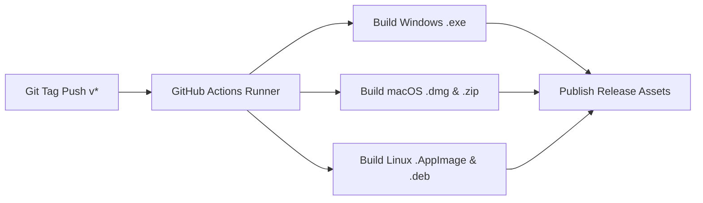
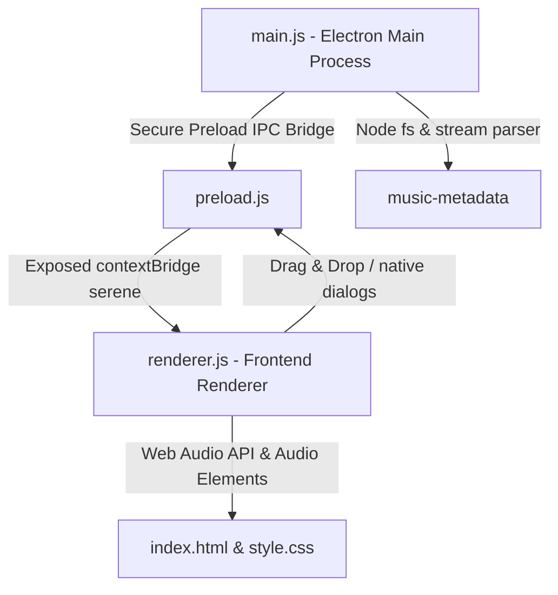

<p align="center">
  
</p>

<h1 align="center">❤ MINI PLAYER | Serene Music Player</h1>

<p align="center">
  <b>A high-performance, frameless, cross-platform audio player built for modern music lovers.</b>
</p>

<p align="center">
  <a href="https://github.com/SuryaK999/Mini-Music-Desktop-Player-/releases/latest"></a>
  <a href="https://github.com/SuryaK999/Mini-Music-Desktop-Player-/actions"></a>
  <a href="https://www.electronjs.org/"></a>
  <a href="https://developer.mozilla.org/en-US/docs/Web/JavaScript"></a>
  <a href="https://opensource.org/licenses/ISC"></a>
</p>

---

Welcome to **❤ MINI PLAYER** (also known as the *Serene Music Player*), an exquisitely styled, frameless, and high-contrast desktop audio player built on the high-performance **Electron.js** shell. Featuring bold Neo-Brutalist design elements, Cyberpunk-inspired retro-futuristic styling, dynamic interactive animations, a high-fidelity metadata reader, and real-time frequency visualizers, it redefines the desktop music listening experience.

---

## 📥 Direct Desktop Downloads

Click any badge below to **instantly download** the compiled installer or portable binary directly for your operating system:

### 🪟 Windows
<p align="left">
  <a href="https://github.com/SuryaK999/Mini-Music-Desktop-Player-/releases/latest/download/Serene-Music-Player-Setup-1.0.0-x64.exe">
    
  </a>
  <a href="https://github.com/SuryaK999/Mini-Music-Desktop-Player-/releases/latest/download/Serene-Music-Player-1.0.0-win-x64.exe">
    
  </a>
</p>

### 🍎 macOS
<p align="left">
  <a href="https://github.com/SuryaK999/Mini-Music-Desktop-Player-/releases/latest/download/Serene-Music-Player-1.0.0-mac-arm64.dmg">
    
  </a>
  <a href="https://github.com/SuryaK999/Mini-Music-Desktop-Player-/releases/latest/download/Serene-Music-Player-1.0.0-mac-x64.dmg">
    
  </a>
</p>

### 🐧 Linux
<p align="left">
  <a href="https://github.com/SuryaK999/Mini-Music-Desktop-Player-/releases/latest/download/Serene-Music-Player-1.0.0-linux-x64.AppImage">
    
  </a>
  <a href="https://github.com/SuryaK999/Mini-Music-Desktop-Player-/releases/latest/download/Serene-Music-Player-1.0.0-linux-x64.deb">
    
  </a>
  <a href="https://github.com/SuryaK999/Mini-Music-Desktop-Player-/releases/latest/download/Serene-Music-Player-1.0.0-linux-x64.tar.gz">
    
  </a>
</p>

> [!TIP]
> View all releases, checksums, and changelogs on the official [GitHub Releases Page](https://github.com/SuryaK999/Mini-Music-Desktop-Player-/releases/latest).

---

## 🎨 Interface & Theme Showcase

Below is a showcase of the **Mini Player** across three of its most iconic, vibrant themes:

| 🎨 RGB Spectrum | 🌸 Rose Gold | 🍭 Hyperpop Rave |
| :---: | :---: | :---: |
|  |  |  |

---

## 🔥 Key Features

### ✨ Visual Brilliance & Neo-Brutalist Styling
*   **Frameless Translucent Window:** An ultra-premium, frameless container with smooth, customized drag-ready headers (`frame: false`, `transparent: true`).
*   **Synchronized Vinyl Disc Animation:** Features an interactive rotating vinyl record design that spins smoothly when audio plays, carrying the embedded album art of the active track.
*   **Real-time Frequency-Reactive Glow:** A dynamic ambient shadow behind the playing vinyl disc that pulses and spreads based on live low-end bass frequencies.
*   **8 Interactive Theme Profiles:** Single-click cycling system to swap across high-contrast, breathtaking HSL palettes:
    1.  🎨 **RGB Spectrum** (`theme-rgb`) - Cybernetic colors.
    2.  🌌 **Midnight Shadow** (`theme-midnight`) - Deep indigo & dark slate.
    3.  🌸 **Rose Gold** (`theme-rose`) - Soft champagne & blush gold.
    4.  🌲 **Emerald Forest** (`theme-emerald`) - Deep jade & botanical green.
    5.  ❄ **Arctic Glare** (`theme-arctic`) - Frosted silver & cold white.
    6.  ⚡ **Neon Cyberspace** (`theme-neon`) - Bipolar hot pink & toxic cyan.
    7.  🌅 **Aurora Borealis** (`theme-aurora`) - Ethereal polar green & violet.
    8.  🍭 **Hyperpop Rave** (`theme-hyperpop`) - High-saturation bubblegum pop.

### 🎚 High-End Audio & Queue Controls
*   **Equalizer Audio Visualizer:** High-performance, four-bar audio equalizer that parses and animates to live sound frequencies using the HTML Web Audio API.
*   **Slide-up Playlist Queue Drawer:** An elegant drawer overlay carrying song indices, titles, and deletion triggers. Double-clicking any item instantly jumps to that track.
*   **Drag & Drop Desktop Integration:** Seamlessly drag audio files (`.mp3`, `.wav`, `.flac`, `.m4a`) from your OS desktop or file manager directly into the window to queue them instantly.
*   **Drag-to-Seek Precision Bar:** Click or drag along the seek timeline to skip to any timestamp with live timer counters and status bar fillers.

### 🧠 Aggressive Audio Parsing & Metadata Scrubbing
*   **Embedded Metadata Extractor:** Communicates with the Electron backend to parse binary streams and read raw embedded metadata using the `music-metadata` engine (obtaining track title, artist names, and high-res binary album art).
*   **Clean String Algorithm:** An aggressive regex cleaner that scrubs redundant filenames, site links, promotional banners, bitrates, and index tags so you see a clean title marquee:
    *   *Scrubbed clutter:* `[iSongs.info]`, `(SenSongsMp3.Co)`, `-SenSongs`, `(MP3 320kbps)`, `[160k]`, `(Official Audio)`, `_HQ`, `_HD`, etc.
    *   *Clean marquee:* Converts `01 - [iSongs.info] Sweet-Child-O-Mine (MP3 320kbps).mp3` into `Sweet Child O Mine`.
*   **Intelligent Text Marquee:** Automatically scrolls long text banners smoothly if titles exceed the visual bounds of the player.

---

## 🎹 Keyboard Shortcuts

Operate the player effortlessly with global keyboard hotkeys:

| Key Input | Action |
| :--- | :--- |
| **`Spacebar`** | Play / Pause active playback |
| **`Arrow Right`** | Skip to the next track in the queue |
| **`Arrow Left`** | Skip to previous track (or restart track if time > 3s) |
| **`Arrow Up`** | Increase volume by **5%** |
| **`Arrow Down`** | Decrease volume by **5%** |

---

## ⚙ Continuous Integration & Automated Builds

This repository is equipped with fully automated **GitHub Actions CI/CD workflows**:



- **[release.yml](.github/workflows/release.yml)**: Automatically triggered on `git tag v*` pushes or manually via `workflow_dispatch`. Compiles and publishes binaries for Windows, macOS (Intel & Apple Silicon), and Linux directly to GitHub Releases.
- **[ci.yml](.github/workflows/ci.yml)**: Continuous integration pipeline running cross-platform build validation on every pull request and push to `main`/`master`.

---

## 🛠 Technical Architecture

The player utilizes a secure multi-threaded desktop framework:



*   **Main Process (`main.js`):** Instantiates the transparent desktop shell, handles cross-platform window lifecycles, and performs backend file metadata extraction using `music-metadata`.
*   **Preload Bridge (`preload.js`):** Exposes safe, isolated APIs from the host OS directly to the frontend window via `contextBridge`.
*   **Renderer Process (`renderer.js`):** Manages the user interface, Web Audio visualizer, timeline seeking, playlist queue, theme swapping, and string sanitization.

---

## 📂 Project Structure

```text
music-player/
├── .github/
│   └── workflows/
│       ├── ci.yml              # Automated continuous integration workflow
│       └── release.yml         # Automated multi-platform release builder
├── assets/                     # UI assets & theme screenshots
│   ├── disc2.png               # Default spinning vinyl center cover art
│   ├── music.png               # Native application window icon
│   ├── screenshot_rgb.png      # RGB Spectrum theme screenshot
│   ├── screenshot_rose.png     # Rose Gold theme screenshot
│   └── screenshot_hyperpop.png # Hyperpop Rave theme screenshot
├── index.html                  # Main user interface layout
├── main.js                     # Electron main process entry point
├── preload.js                  # IPC security bridge
├── renderer.js                 # Player engine logic & Web Audio visualizer
├── style.css                   # Theme definitions & Neo-Brutalist CSS
├── package.json                # Cross-platform electron-builder settings
└── README.md                   # Application documentation
```

---

## 🚀 Quick Start & Installation

### Prerequisites
Ensure you have [Node.js](https://nodejs.org/) (v18.0.0 or higher recommended) installed.

### Installation Steps

1.  **Clone the Repository:**
    ```bash
    git clone https://github.com/SuryaK999/Mini-Music-Desktop-Player-.git
    cd Mini-Music-Desktop-Player-
    ```

2.  **Install Dependencies:**
    ```bash
    npm install
    ```

3.  **Run Development Mode:**
    ```bash
    npm start
    ```

4.  **Build Production Binaries:**
    ```bash
    # Build for current platform
    npm run build

    # Build specifically for targeted platforms
    npm run build:win
    npm run build:mac
    npm run build:linux
    ```

---

## 📄 License

This software is distributed under the open-source **ISC License**. Feel free to customize, modify, and distribute it.

---

<p align="center">
  <i>Made with ❤ for music enthusiasts and desktop app developers.</i>
</p>
