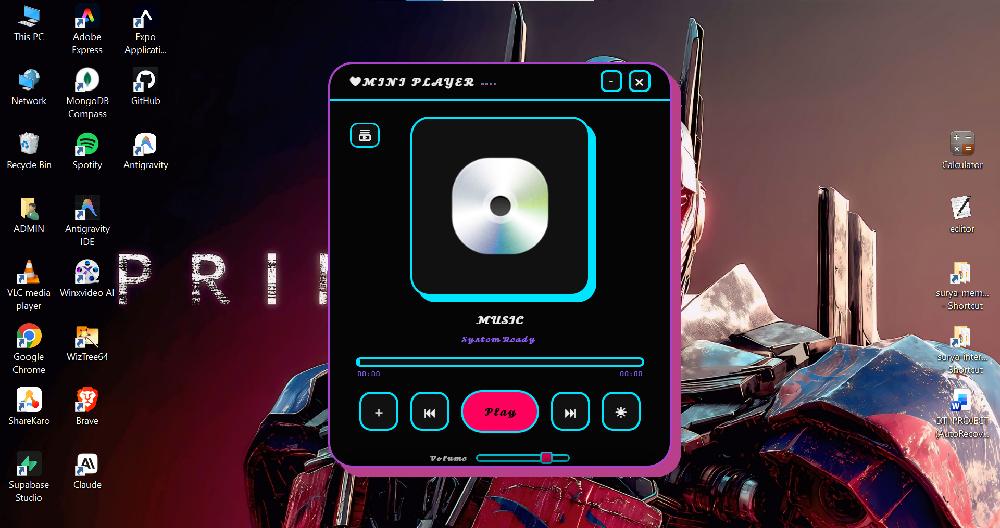
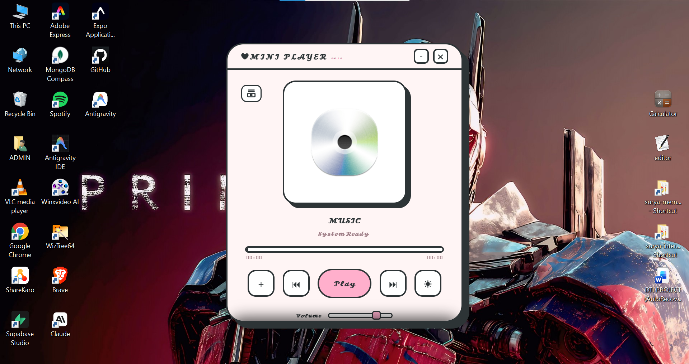
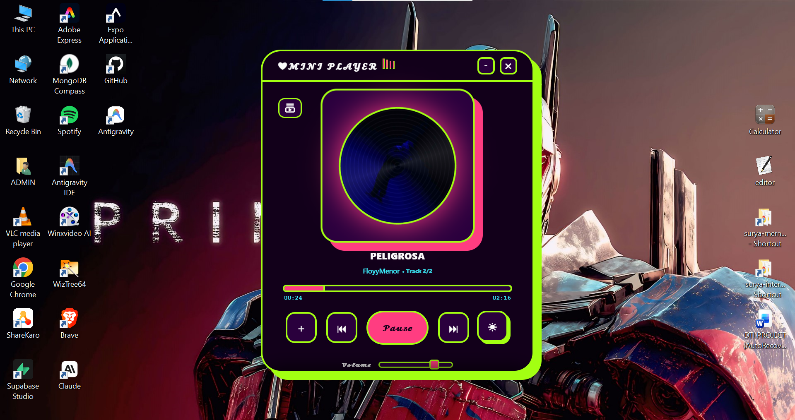
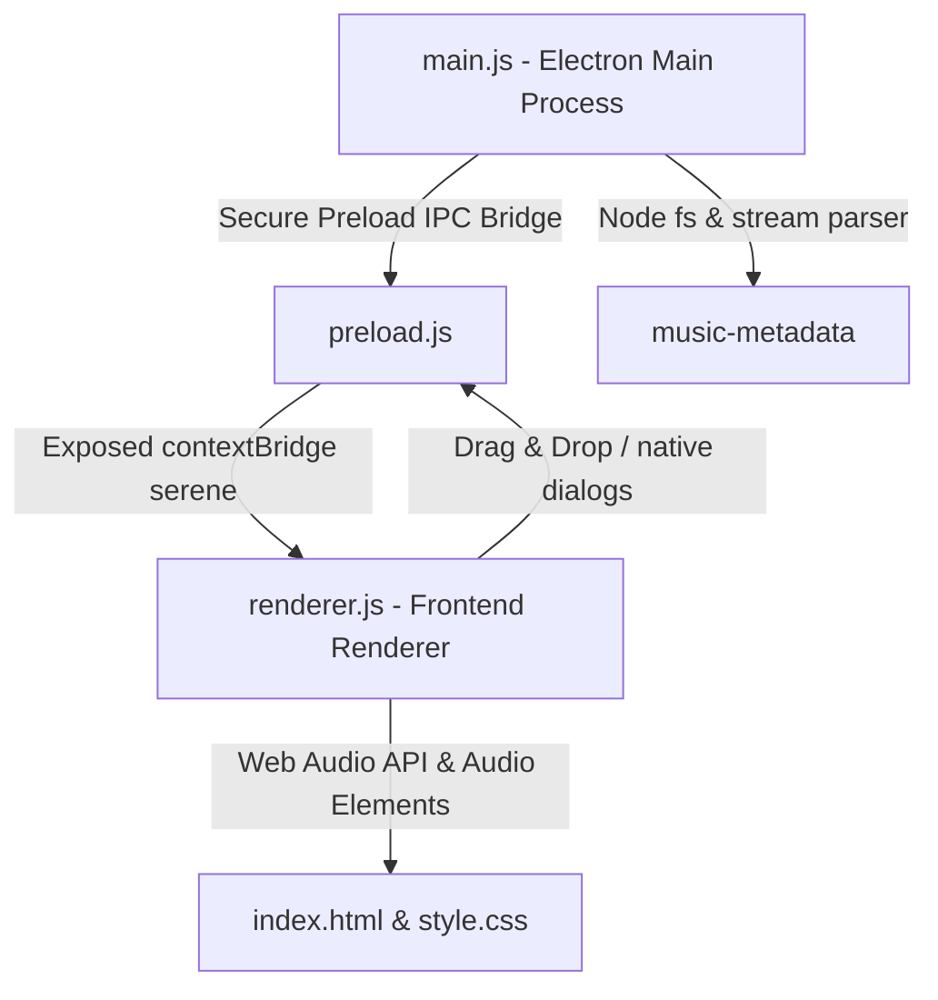

# 🎵 ❤ MINI PLAYER | Serene Music Player

[](https://www.electronjs.org/)
[](https://developer.mozilla.org/en-US/docs/Web/JavaScript)
[](https://developer.mozilla.org/en-US/docs/Web/CSS)
[](https://opensource.org/licenses/ISC)

Welcome to **❤ MINI PLAYER** (also known as the *Serene Music Player*), an exquisitely styled, frameless, and semi-transparent desktop audio player built on the high-performance **Electron.js** shell. Featuring gorgeous premium dark aesthetics, glassmorphic structures, dynamic interactive animations, a high-fidelity metadata reader, and real-time frequency visualizers, it redefines the desktop music listening experience.

---

## 🎨 Interface & Screenshots Showcase

Below is a showcase grid of the **Mini Player** in action across different high-contrast themes.

| 🌌 Midnight Shadow | 🎨 RGB Spectrum |
| :---: | :---: |
|  |  |

| 🌲 Emerald Forest | 🌸 Rose Gold |
| :---: | :---: |
|  |  |

| 🍭 Hyperpop Rave |
| :---: |
|  |

> [!TIP]
> ### 📸 How to show your real desktop player images on GitHub:
> 1. Launch your music player locally by running `npm start`.
> 2. Click the theme cycle button (**☀**) to select a theme (e.g. Midnight, RGB, Neon, Rose).
> 3. Take a quick screenshot crop of the running application on your screen.
> 4. Save your screenshots directly inside your local `assets/` folder with these names:
>    * `screenshot_midnight.png`
>    * `screenshot_rgb.png`
>    * `screenshot_neon.png`
>    * `screenshot_rose.png`
> 5. Commit and push the files:
>    ```bash
>    git add assets/
>    git commit -m "docs: add actual desktop player screenshots"
>    git push
>    ```
> Once pushed, these images will instantly replace the placeholders and display your actual desktop player design to everyone on GitHub!

---

## 🔥 Key Features

### ✨ Visual Brilliance & Glassmorphic Design
*   **Frameless Translucent Window:** An ultra-premium, frameless container with smooth, customized drag-ready headers (`frame: false`, `transparent: true`).
*   **Synchronized Vinyl Disc Animation:** Features an interactive rotating vinyl record design that spins smoothly when audio plays, carrying the embedded album art of the active track.
*   **Real-time Frequency-Reactive Glow:** A dynamic ambient shadow behind the playing vinyl disc that pulses and spreads based on the real-time intensity of the low-end bass frequencies.
*   **8 Interactive Theme Profiles:** Single-click cycling system to swap across high-contrast, breathtaking HSL palettes:
    1.  🎨 **RGB Spectrum** (`theme-rgb`) - Cybernetic colors.
    2.  🌌 **Midnight Shadow** (`theme-midnight`) - Deep indigo & dark slate.
    3.  🌸 **Rose Gold** (`theme-rose`) - Soft champagne & blush gold.
    4.  🌲 **Emerald Forest** (`theme-emerald`) - Deep jade & botanical green.
    5.  ❄ **Arctic Glare** (`theme-arctic`) - Frosted silver & cold white.
    6.  ⚡ **Neon Cyberspace** (`theme-neon`) - Bipolar hot pink & toxic cyan.
    7.  🌅 **Aurora Borealis** (`theme-aurora`) - Ethereal polar green & violet.
    8.  🍭 **Hyperpop Rave** (`theme-hyperpop`) - High-saturation bubblegum pop.

### 🎚 High-End Audio & Queue Controls
*   **Equalizer Audio Visualizer:** High-performance, four-bar audio equalizer that parses and animates to live sound frequencies using the HTML Web Audio API.
*   **Slide-up Playlist Queue Drawer:** An elegant drawer overlay carrying song indices, titles, and deletion triggers. Seamless double-click interaction allows you to jump directly to any track in the queue.
*   **Drag & Drop Desktop Integration:** Seamlessly drag audio files (`.mp3`, `.wav`, `.flac`, `.m4a`) from your operating system desktop or file manager directly into the window to queue them instantly.
*   **Drag-to-Seek Precision Bar:** Click or drag along the seek timeline to instantly skip to any moment of the song, complete with real-time timer counters and visual status bar fillers.
*   **Built-in Keyboard Shortcuts:** Power-user friendly controls mapped directly to standard key inputs.

### 🧠 Aggressive Audio Parsing & Cleaning
*   **Embedded Metadata Extractor:** Communicates with the Electron backend to parse binary streams and read raw embedded metadata using the `music-metadata` engine (obtaining pure track title, artist names, and high-quality binary album art).
*   **Clean String Algorithm:** An extremely aggressive, built-in regex cleaner that scrubs redundant filenames, site links, promotional banners, bitrates, and index tags so you see a clean, professional aesthetic:
    *   *Scrubbed clutter:* `[iSongs.info]`, `(SenSongsMp3.Co)`, `-SenSongs`, `(MP3 320kbps)`, `[160k]`, `(Official Audio)`, `_HQ`, `_HD`, etc.
    *   *Clean marquee:* Converts a cluttered name like `01 - [iSongs.info] Sweet-Child-O-Mine (MP3 320kbps).mp3` into a beautifully formatted `Sweet Child O Mine`.
*   **Intelligent Text Marquee:** Automatically animates and scrolls long text banners leftwards if the track title or artist details exceed the visual bounds of the player.

---

## 🎹 Keyboard Shortcuts Cheat Sheet

Operate the player like a professional with these instantaneous global hotkeys:

| Key Input | Action |
| :--- | :--- |
| **`Spacebar`** | Play / Pause active playback |
| **`Arrow Right`** | Skip to the next track in the queue |
| **`Arrow Left`** | Skip to the previous track (or restart if current time is > 3s) |
| **`Arrow Up`** | Increase application volume in fine steps of **5%** |
| **`Arrow Down`** | Decrease application volume in fine steps of **5%** |

---

## 🛠 Technical Architecture

The player utilizes a secure multi-threaded desktop framework:



*   **Main Process (`main.js`):** Instantiates the transparent desktop shell, opens the native select system file picker, and performs backend file parsing using `music-metadata`.
*   **Preload Bridge (`preload.js`):** Exposes safe, isolated APIs from the host OS directly to the frontend window without exposing sensitive Node.js dependencies globally.
*   **Renderer Process (`renderer.js`):** Directs the user interface, keyboard navigation, Web Audio visualizer, playback timeline, playlist queue memory, theme swap classes, and string sanitization.

---

## 📂 Project Structure

```text
music-player/
├── assets/                  # UI assets & resources
│   ├── disc2.png            # Default spinning vinyl center cover art
│   ├── music.png            # Native application window icon
│   ├── screenshot_midnight.png # Real Midnight theme screenshot
│   ├── screenshot_rgb.png      # Real RGB theme screenshot
│   ├── screenshot_rose.png     # Real Rose Gold theme screenshot
│   ├── screenshot_emerald.png  # Real Emerald Forest theme screenshot
│   └── screenshot_hyperpop.png # Real Hyperpop Rave theme screenshot
├── node_modules/            # [IGNORED] External Node dependencies
├── index.html               # Main user interface framework
├── main.js                  # Electron application entry point
├── preload.js               # Safe security IPC interface layer
├── renderer.js              # Application frontend execution logic
├── style.css                # Premium styling sheets and theme rules
├── .gitignore               # [NEW] Git ignore specification file
├── package.json             # App packaging & package details
└── README.md                # Comprehensive documentation
```

---

## 🚀 Quick Start & Installation

### Prerequisites
Ensure you have [Node.js](https://nodejs.org/) installed (v16.0.0 or higher recommended).

### Installation Steps

1.  **Clone the Repository:**
    ```bash
    git clone https://github.com/SuryaK999/Mini-Music-Desktop-Player-.git
    cd music-player
    ```

2.  **Install Dependencies:**
    ```bash
    npm install
    ```

3.  **Run the Music Player:**
    ```bash
    npm start
    ```

---

## 🛡 Git Ignore & GitHub Best Practices

To ensure your GitHub repository remains lightweight, secure, and clean, a production-ready `.gitignore` file has been added in the project root.

> [!WARNING]
> **NEVER** force-commit or upload `node_modules/` or local test music files to GitHub.

### Why do we ignore these specific files?

1.  **`node_modules/` Directory:**
    *   *Reason:* Contains massive binaries and packages (like Electron itself) totaling **100MB+** of code that change with every build. Committing this causes repository bloat, slow clone times, and merge conflicts.
    *   *Solution:* Always let developers run `npm install` to download dependencies fresh from the NPM Registry.
2.  **Sensitive Environment Variables (`.env`, `*.env`):**
    *   *Reason:* If you configure custom client keys, cloud storage logins, or API keys, committing these files publishes your credentials publicly to GitHub.
3.  **Local Audio Files (`*.mp3`, `*.wav`, `*.flac`, `*.m4a`, `songs/`, `music/`):**
    *   *Reason:* Media files are heavy. Git is meant for text source code. Commit-tracking several gigabytes of audio tracks will slow down Git actions and hit GitHub's absolute file limit rules (100MB).
    *   *Solution:* Create a local folder called `songs/` or `music/` inside your project for sandbox testing. Since it is added to `.gitignore`, it will stay safely offline in your computer!
4.  **Operating System Trash (`.DS_Store`, `Thumbs.db`):**
    *   *Reason:* Auto-generated system clutter that has no relevance to your application's logic.

### Commands for Managing Ignored Files

If you accidentally tracked any sensitive files or `node_modules/` *before* adding the `.gitignore` file, they will still be tracked by Git. Run these commands in your terminal to untrack them:

*   **Untrack `node_modules/` safely (keeps files on your disk, deletes from git repository):**
    ```bash
    git rm -r --cached node_modules/
    ```

*   **Untrack local audio files safely:**
    ```bash
    git rm -r --cached *.mp3 *.wav *.flac *.m4a
    ```

*   **Apply the new `.gitignore` rules and commit the updates:**
    ```bash
    git add .gitignore
    git commit -m "chore: implement robust security and dependency ignore rules"
    ```

---

## 📄 License

This software is distributed under the open-source **ISC License**. Feel free to customize, modify, and distribute it to your heart's content!

---

*Made with ❤ for music enthusiasts and desktop builders.*
